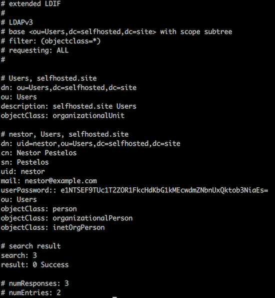

### Copy certificates

```
scp -r ../certs core@ldap.selfhosted.site:/home/core/
```

### Copy openldap.service.example

```
scp openldap.service.example core@ldap.selfhosted.site:/home/core/openldap.service
```

### Shell into ldap.selfhosted.site

```
ssh core@ldap.selfhosted.site
```

### Create directories

```
mkdir -p /home/core/openldap/etc
mkdir -p /home/core/openldap/data
```

### Customize seeds.ldif

```
vi seeds.ldif
```

At a minimum, we expect a single Organizational Unit (OU) and a single User

Use `slappasswd` to generate a new password.

### Customize openldap.service

```
vi openldap.service
```

Provide values for these variables:

* LDAP_ORGANISATION
* LDAP_DOMAIN
* LDAP_ADMIN_PASSWORD

### Move openldap.service

```
sudo mv openldap.service /etc/systemd/system/
```

### Load service

```
sudo systemctl daemon-reload
```

### Start service

```
sudo systemctl start openldap.service
```

### Check status

```
sudo systemctl status openldap.service
```

### Exit ldap.selfhosted.site

```
exit
```

### Test

Connect to `ldap.selfhosted.site` from your local machine:

```
ldapsearch -x -h ldap.selfhosted.site -b dc=selfhosted,dc=site -D "cn=admin,dc=selfhosted,dc=site" -w <LDAP_ADMIN_PASSWORD> -Z
```



### Load seeds.ldif

```
ldapadd -x -h ldap.selfhosted.site -D "cn=admin,dc=selfhosted,dc=site" -w <LDAP_ADMIN_PASSWORD> -f seeds.ldif -Z
```