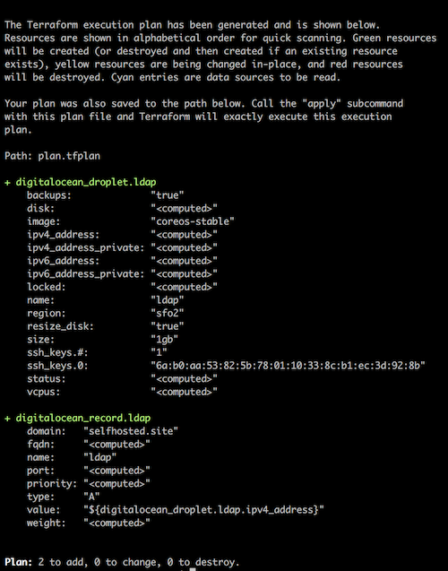
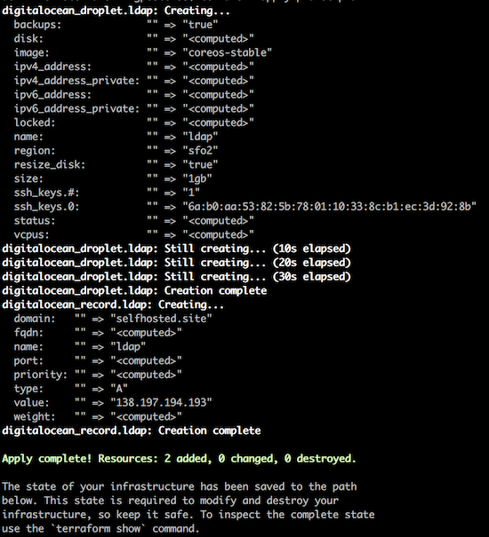

Provision droplets
==================

Use [terraform](https://terraform.io) to provision droplets.

### Generate execution plan

```
terraform plan -out plan.tfplan -var "do_token=$DO_TOKEN" -var "do_ssh_key=$DO_SSH_KEY"
```



### Apply execution plan

```
terraform apply plan.tfplan
```


